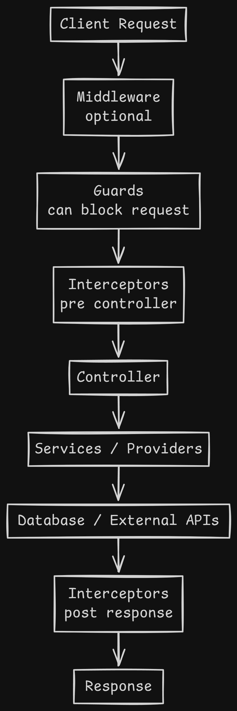

# Introduction to NestJS

NestJS is a powerful tool for building server-side applications with Node.js. Think of it as a framework that gives you a solid structure and a set of tools to create applications that are easy to manage, grow, and maintain.

It's built with TypeScript, which helps you write cleaner and more reliable code.

## Core Architecture

At its heart, NestJS organizes your code into a clear and logical structure. The main building blocks are **Modules**, **Controllers**, and **Providers** (often called Services).

### How it Works:

1.  **Controllers**: These handle incoming requests from users. When a user goes to a specific URL in your application, a controller is responsible for receiving that request and deciding what to do with it.

2.  **Providers (Services)**: These contain the actual business logic of your application. Instead of putting all the logic in the controller, you separate it into services. For example, if you need to get a list of users from a database, you would have a `UsersService` that handles that task. The controller would then use this service to get the data. This makes your code much cleaner and easier to test.

3.  **Modules**: Modules are a way to group related controllers and providers together. Think of them as containers for different parts of your application. For example, you might have a `UsersModule` that contains the `UsersController` and `UsersService`. This helps keep your application organized as it grows.

This modular structure makes NestJS applications scalable and easy to manage.

