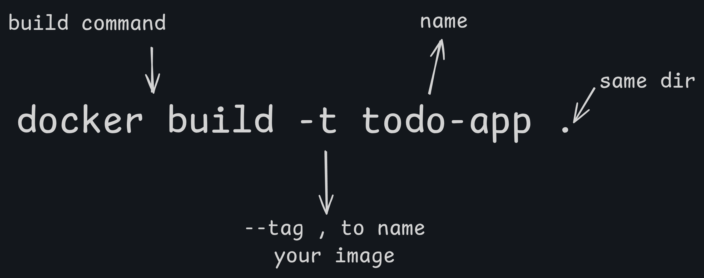
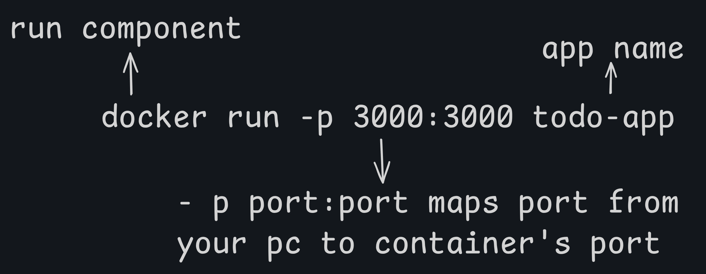

# Docker Commands 

This file provides a quick reference for the most common Docker commands used to build, run, and manage this application.

**Note for Linux Users:** Depending on your setup, you may need to prefix all `docker` commands with `sudo`.


## Building the Image



To create a Docker image from your app, use:

```bash
docker build -t todo-app .
```

* `-t todo-app` tags the image with a human-readable name.
* `.` specifies the current directory as the build context.

### What if you skip `-t`?

If you run:

```bash
docker build .
```

Docker will still build the image, but:

* It won’t have a meaningful name.
* You'll need to reference it using its **image ID** (e.g., `docker run <image-id>`), which is harder to manage.

**Always use `-t`** to simplify image management, versioning (`-t todo-app:v1`), and pushing to a registry.


## Running the Container

### Basic Run (Foreground)

This command runs the container in the foreground, which is useful for debugging as logs are printed directly to your terminal.



```bash
docker run -p 3000:3000 todo-app
```
- `-p 3000:3000`: Maps port 3000 on your machine to port 3000 in the container.

### Background Run

This command runs the container in detached mode (in the background) and gives it a specific name for easier management.

```bash
docker run -d -p 3000:3000 --name my-todo-app todo-app
```
- `-d`: Detached mode.
- `--name my-todo-app`: Assigns a custom name to the container.

## Running with Data Persistence - Named Volumes

To ensure your `todo.db` data is not lost when the container stops, run it with a named volume.

```bash
docker run -d -p 3000:3000 -v todo-data:/usr/src/app/dist --name my-todo-app todo-app
```
- `-v todo-data:/usr/src/app/dist`: Creates a named volume `todo-data` and mounts it to the `dist` directory inside the container, persisting the database file.


## Managing Containers

### List Running Containers

See all containers that are currently running.

```bash
docker ps
```

To see all containers (including stopped ones), add the `-a` flag:
```bash
docker ps -a
```

### View Container Logs

Follow the logs of a running container. This is essential for debugging.

```bash
docker logs -f my-todo-app
```
- `-f`: Follow the log output.

### Stop a Container

Stops a running container gracefully.

```bash
docker stop my-todo-app
```

### Remove a Container

Deletes a **stopped** container. You cannot remove a running container without forcing it.

```bash
docker rm my-todo-app
```


## Managing Volumes

### List Volumes

See all the Docker volumes on your system.

```bash
docker volume ls
```

### Remove a Volume

Deletes a volume. **Warning: This will permanently delete the data stored in the volume (e.g., your todo database).**

```bash
docker volume rm todo-data
```
Certainly. Here's the explanation of Docker volume types in a structured, paragraph-based format, suitable for a README or documentation:

## Types of Docker Volumes

Docker provides two main types of volumes for persisting data between container runs: named volumes and bind mounts.

**Named volumes** are managed entirely by Docker. When you create a named volume, Docker stores it in a designated location on the host machine, abstracting away the actual path. This makes named volumes portable, as you do not need to worry about differences in host file system structures across environments. They are ideal for production environments where you want Docker to manage data persistently and cleanly. In practice, a named volume can be attached to a container using the `-v` flag in the format `-v volume-name:/container/path`. For example, running a container with `-v todo-data:/usr/src/app/dist` mounts a Docker-managed volume named `todo-data` to the `/usr/src/app/dist` directory inside the container. If the volume does not exist, Docker automatically creates it.

**Bind mounts**, on the other hand, map a specific file or directory on the host machine directly to a path inside the container. This method gives you full control over the location of the data on the host. Bind mounts are particularly useful in development environments, as any changes made to the files in the mounted directory on the host are immediately reflected in the container. This is beneficial for tasks such as live editing, debugging, or using file watchers. A common usage would look like `-v $(pwd)/dist:/usr/src/app/dist`, which mounts the `dist` folder from your current working directory into the container at the specified path.

